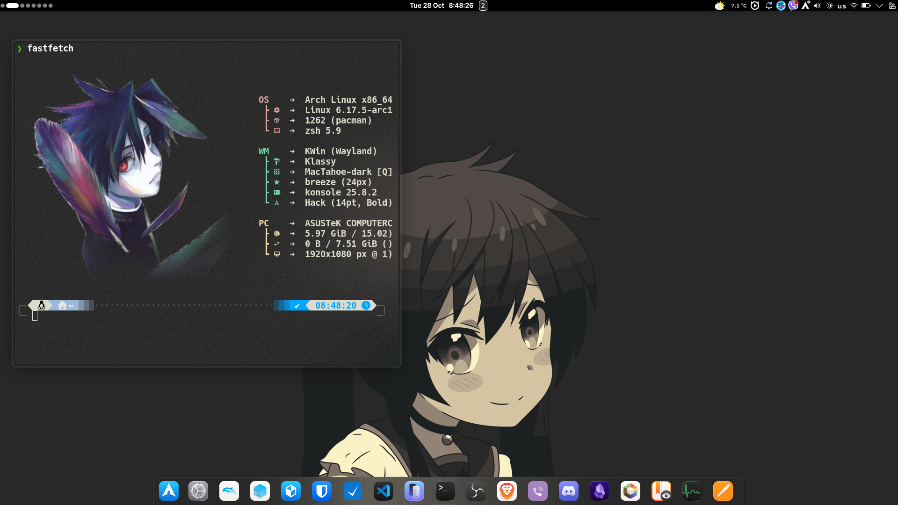
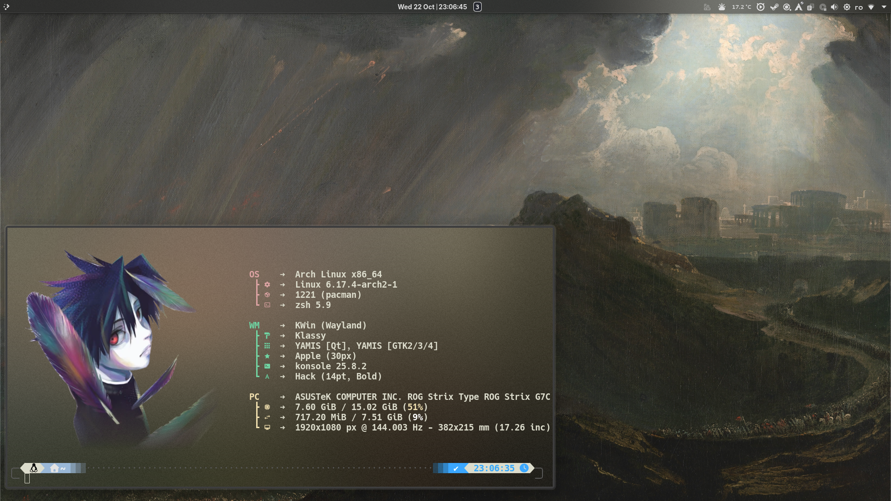

# 🌌 KDE PLASMA RICE — *Gruvbox Tahoe Setup*

A clean, dynamic, and minimal KDE Plasma configuration inspired by Gruvbox and macOS Tahoe design.  
Focuses on smooth animations, blur effects, and tiling efficiency.


---

## 🧩 System & Interface

### 🖥️ Desktop Layout
**Top Bar Widgets:**
- `Ginti` *(left side)*
- `Clock`, `Compact Pager` *(center)*
- `System Tray` *(right side — includes Adaptifier, Battery, Weather, Panel Colorizer)*

**Bottom Dock:**
- `Tahoe Launcher`
- `Task Manager (Only Running Applications)`

**Wallpaper:**  
- Gruvbox-inspired blurry wallpaper

---

### ✨ Effects
- Magic Lamp  
- Wobbly Windows  
- Better Blur  
- Fading Popups *(Kinetic)*  
- Maximize Animation *(Kinetic)*  
- Morphing Popups  

---

## 🎨 Global Theme

| Category | Setting |
|-----------|----------|
| **Color Scheme** | Kvantum Dark (accent from wallpaper) |
| **Application Style** | Kvantum Dark |
| **Plasma Style** | JuxPlasma *(customized)* |
| **Window Decoration** | Klassy |
| **Icons** | Mac Tahoe Dark *(macOS-like)* |
| **Cursor** | Breeze Dark / Tahoe Dark / Black variant |
| **Splash Screen** | KDE Splash Dynamic |
| **Login (SDDM)** | Monochrome Plasma 6 |

---

## 🪟 Scripts & Tiling

**Tiling Script:** [Krohnkite]
Configuration:
```ini
Gaps:
  Left / Bottom / Right: 15px
  Top / Center: 20px
```

## Aplcations

**Konsole**
- `zsh`*(oh-my-zsh for costumization)*